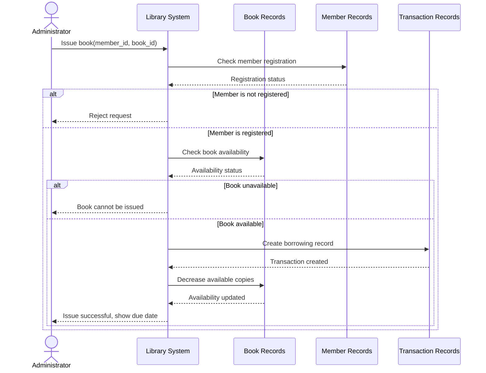

# Sequence Diagram — Issue Book

```mermaid
sequenceDiagram
    actor Admin as Administrator
    participant LMS as Library System
    participant Books as Book Records
    participant Members as Member Records
    participant Tx as Transaction Records

    Admin->>LMS: Issue book(member_id, book_id)
    LMS->>Members: Check member registration
    Members-->>LMS: Registration status

    alt Member is not registered
        LMS-->>Admin: Reject request
    else Member is registered
        LMS->>Books: Check book availability
        Books-->>LMS: Availability status

        alt Book unavailable
            LMS-->>Admin: Book cannot be issued
        else Book available
            LMS->>Tx: Create borrowing record
            Tx-->>LMS: Transaction created
            LMS->>Books: Decrease available copies
            Books-->>LMS: Availability updated
            LMS-->>Admin: Issue successful, show due date
        end
    end
```
