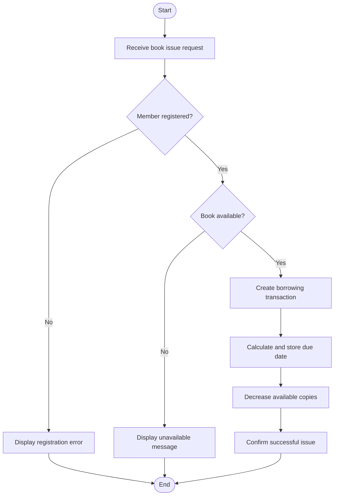

# Activity Diagram — Issue Book Workflow

```mermaid
flowchart TD
    A([Start]) --> B[Receive book issue request]
    B --> C{Member registered?}

    C -- No --> D[Display registration error]
    D --> Z([End])

    C -- Yes --> E{Book available?}

    E -- No --> F[Display unavailable message]
    F --> Z

    E -- Yes --> G[Create borrowing transaction]
    G --> H[Calculate and store due date]
    H --> I[Decrease available copies]
    I --> J[Confirm successful issue]
    J --> Z
```
